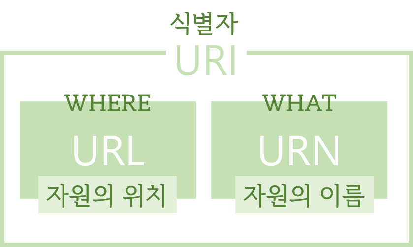

## URI URL URN

### URI (Uniform Resource Identifier)

통합 자원 식별자, 인터넷에 있는 자원을 나타내는(구분하는) 유일한 주소이다. **식별자(ID)** 로서의 의미가 강하다. 객관적인 구별 방법이다.

### URL (Uniform Resource Locator)

네트워크에 존재하는 자원의 **위치**를 말한다. 어디에 위치하는지, where의 개념이다. 흔히 웹 사이트 주소로 알고 있지만, URL은 웹 사이트 주소 뿐만 아니라 네트워크 상의 모든 자원을 나타낼 수 있다.

### URN (Uniform Resource Name)

자원의 **이름**을 나타낸다. 자원이 무엇인지 알려주는, What의 개념이다. URN은 중복되지 않는 유일한 값이어야 한다.

## 특징

1. URI안에 URN과 URL이 존재한다.
2. URL은 Where의 개념으로서, 자원에 접근하는 방법이나 네트워크의 위치를 표현하고 있어야 한다. http:// 등이 포함되면 URL이라고 볼 수 있다.
3. URN은 해당 자원이 무엇인지 유일하게 식별하는 이름이다. 자원간에 이름 중복이 발생해선 안된다.

## 예시

URI의 구성은 다음과 같다.

> protocol(necessary) + domain name(necessary) + port + path to the file + parameters + anchor

- protocol: 네트워크상 브라우저가 데이터를 주고 받기 위한 통신규약
- domain name: request를 보내려는 웹서버, IP주소를 사용했으나 불편한 점이 많아 domain nam을 문자열로 정의하고 ip address로 변경해주는 dns 등장.
- port: http 표준 포트는 80, https 표준 포트번호는 443번. 웹서버가 프로토콜의 표준 포트번호를 사용하면 url에서 port는 버려짐
- path: web server 리소스 경로, 근래는 file의 물리적 경로를 사용하지 않고 추상화된 경로 사용

> http://opentutorials.org:3000/main?id=HTML&page=12

http > 프로토콜
opentutorials.rog > host(domain)
3000 > port
main > path
id=HTML&page=12 > qury string

이때 http://opentutorials.org:3000/main 까지는 URL(URI)이고, http://opentutorials.org:3000/main?id=HTML&page=12 는 URI다.

URI는 자원의 식별자로, ?id=HTML&page=12 부분은 위치가 아닌 값을 식별하는 식별자이기 때문에 URI로 분류된다.
